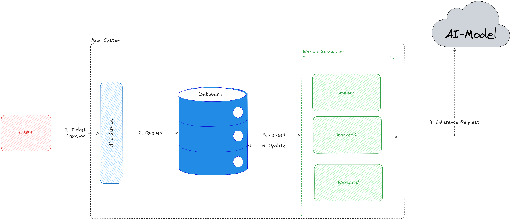

# T2: Tickets 2.0

A Concurrent & Parallelized Ticket Inference System

## Quickstart

To run the system do the following:

- Create your **.env** file following the .env.example it is required to contain your OPENAI_API_KEY
- run the following commands:

```
pip install -r requirements.txt
docker compose up
```

## Architecture Overview



The workflow above highlights the Architecture required to provide the main functionality to our system, separated into multiple subsystem

- **API Gateway**: The API Gateway is built with FastAPI due to the quick and easy Iteration Structure that it provides. Furthermore, FastAPI provides easy concurrency by design and many built-in Error Handling for various edge-cases. As highlighted above we utilize the API-Gateway to only queue/retrieve Work-Loads without doing any of the actual **heavy lifting** here, allowing our system to handle many requests at a time. Here are the different API Endpoints we have:
  - **POST `/tickets/`**: Creates and queues a Ticket for asynchronous processing.

  - **GET `/tickets/{ticket_id}`**: Retrieves a specific Ticket and its current processing/classification state.

  - **GET `/tickets/`**: Retrieves Tickets with optional `category` and `priority` filtering and pagination.

- **Database**: We use **PostgreSQL** as our DB engine as PostgreSQL is simple, efficient, and highly Stable we utilize a DB as our **database work queuing** system utilizing various PostgreSQL capabilities to our advantage. An example is **FOR UPDATE SKIP LOCKED** which provides a highly efficient way to prevent race conditions in initial queries. Here is our database schema:
  Our Ticket schema is structured as follows:

  | Field           | Type               | Description                                                                     |
  | --------------- | ------------------ | ------------------------------------------------------------------------------- |
  | `id`            | `TEXT`             | Unique Ticket ID and Primary Key                                                |
  | `subject`       | `TEXT`             | Optional Ticket Subject                                                         |
  | `body`          | `TEXT`             | Ticket Body                                                                     |
  | `status`        | `processing_state` | Current Processing State: `pending`, `processing`, `classified`, or `failed`    |
  | `category`      | `categories`       | Classification Category: `billing`, `technical`, `account`, or `other`          |
  | `summary`       | `TEXT`             | One-sentence Model-generated Ticket Summary                                     |
  | `priority`      | `priorities`       | Ticket Priority: `low`, `medium`, or `high`                                     |
  | `leased_until`  | `TIMESTAMPTZ`      | Expiration timestamp for the current Worker Lease                               |
  | `lease_version` | `BIGINT`           | Incrementing Lease Version used to prevent stale Workers from updating a Ticket |

- **Worker**: Our Workers are a Multi-Processing subsystem that does the following:
  - **Pop/Lease**: Our workers **"Lease"** Jobs for a set duration, throughout this duration they are free to work on the Job with no fear of race conditions due to the **leased_until** field.
  - **Infer**: The model is communicated with, with a **Retry Policy** in case of failure, the model output is validated to be within the set schema, and the role of the request is user, furthermore the scope of access for the AI model is limited. Therefore, we have deployed multiple defense mechanisms for the input/output to the model
  - **Update**: The Output is then updated to the DB, with **lease_version** validated to ensure only the latest lease is used.

## Safety and Parallelism

Our main Safety comes in 3 **pillars**:

- **FOR UPDATE SKIP LOCKED**: FOR UPDATE eliminates the race condition caused, allowing us to combine the UPDATE and SELECT Statement to make the ticket **status**: "processing". Moreover, we utilize **SKIP LOCKED** to ensure no waiting/hanging of workers occurs. However this scheme introduces a problem in case of system failure **What if the System Crashes?** This is handled by the Second Pillar
- **leased_until**: Leased_until is validated just as much as state, we also use **Leased_until** to define the period during which workers have exclusive ownership of the ticket without any other worker being able to claim it, this gives us safety against worker crashes and full-system restarts, as any stuck ticket will be eligible to be claimed again. However, this adds a problem, **What if a hung Job resumes?**
- **lease_version**: Simply a lease that expires and then is taken by another Worker changes its **lease_version**, mismatched leases don't get accepted. This provides us with safety from resumed jobs, as their lease will have become outdated.

Overall this structure provides us a lot of safety, while maintaining the ability to handle mid-flight crashes gracefully

## Tradeoffs Made

Many Tradeoffs are made in design, I want to highlight some of the main ones:

- **Custom Messaging Scheme**: The reason I created a custom messaging scheme instead of relying on more well-known messaging schemes such Redis/RabbitMQ is because of one main reason.
  - Less Complexity Overhead: PostgreSQL is simple and easy to handle and we have to have a database for data retention, introducing more systems only increases our attack surface. The use case for our workloads is not the most complicated and can be replicated via our scheme.
  - However, this introduces a problem: Custom written logic by one person means I can introduce system bugs and vulnerabilities that wouldn't have been introduced from using well-known and tested libraries
- **Further Model Validation**: We employ model validation at the model level/Output validation, however further validation can be added earlier on in the pipeline with something as simple as binary classifier to identify prompt injection, and other more robust methodologies. I did not take the time to add them due to two main reasons:
  - Limiting scope due to it not being an actual production system
  - The limited access the AI model has on our Critical Systems such as our DB and the current protection seeming to be good enough to handle the tested prompt injection scenarios

## Testing

After running the system, you can use the following command to run the test suite. The test covers ticket creation and end-to-end asynchronous inference validation from a high-level system perspective:

```
python .\test\test.py .\test\tickets.csv
```
